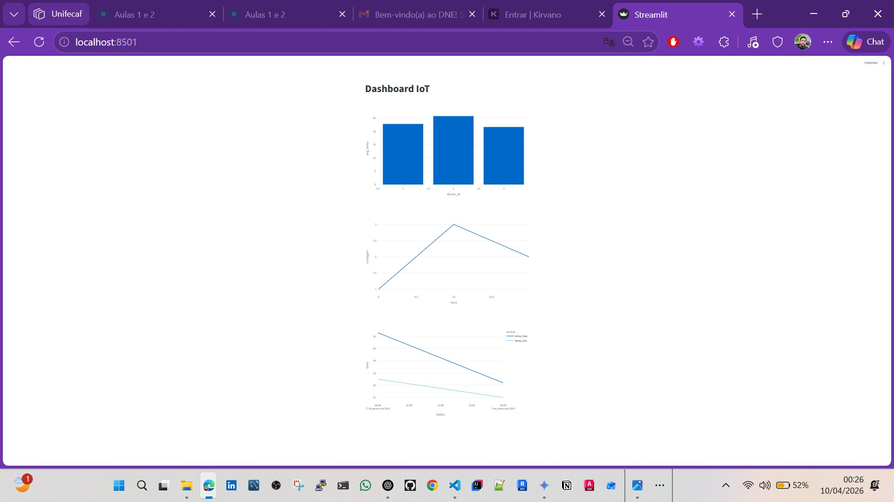
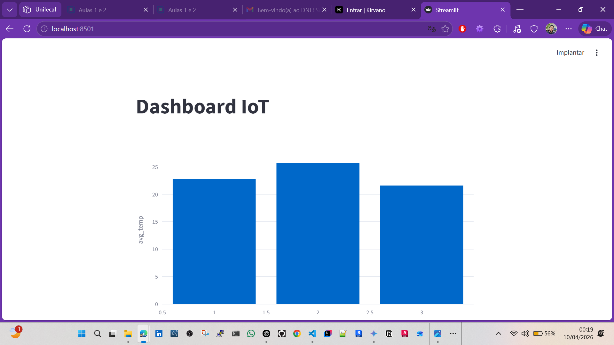
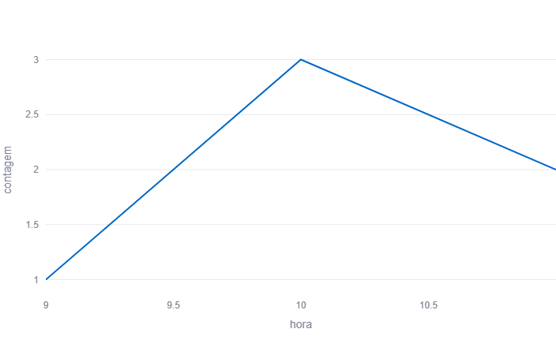
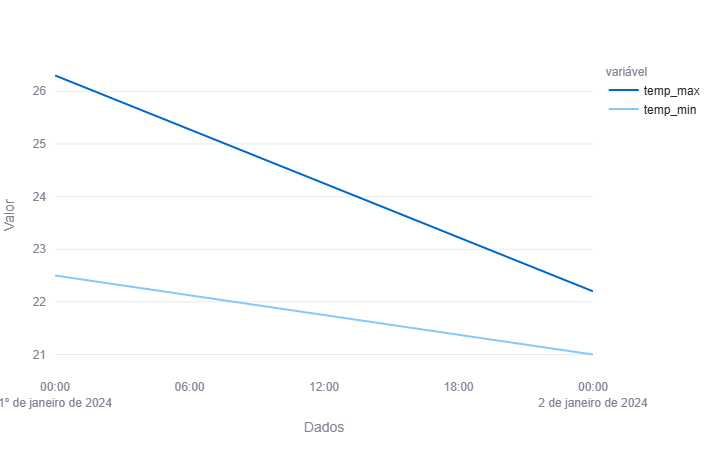

# 🚀 Pipeline de Dados com IoT, Docker e Streamlit

## 📌 Sobre o Projeto

Este projeto implementa um **pipeline de dados completo** para processamento de informações provenientes de dispositivos IoT (sensores de temperatura).

A solução realiza ingestão, processamento, armazenamento e visualização dos dados utilizando tecnologias modernas de Big Data.

---

## 🎯 Objetivo

Desenvolver um pipeline capaz de:

* 📥 Coletar dados de temperatura (CSV)
* ⚙️ Processar os dados com Python
* 🗄️ Armazenar no PostgreSQL (Docker)
* 📊 Criar análises com SQL (Views)
* 📈 Visualizar dados com Streamlit

---

## 🧰 Tecnologias Utilizadas

* 🐍 Python
* 🐳 Docker
* 🐘 PostgreSQL
* 📊 Streamlit
* 📈 Plotly
* 📦 Pandas
* 🔗 SQLAlchemy

---

## 📁 Estrutura do Projeto

```
iot-pipeline/
│
├── data/                  
├── src/                   
│   ├── ingest.py
│   ├── database.py
│   └── views.sql
│
├── dashboard/             
│   └── dashboard.py
│
├── docker/                
│   └── docker-compose.yml
│
├── docs/                  
│   └── relatorio_iot_pipeline.pdf
│
├── requirements.txt
└── README.md
```

---

## ▶️ Demonstração

📊 Dashboard em execução:






> Caso a imagem não apareça, execute o projeto localmente.

---

## ⚙️ Como Executar o Projeto

### 🔹 1. Clonar o repositório

```bash
git clone https://github.com/Jackson9008/iot-pipeline.git
cd iot-pipeline
```

---

### 🔹 2. Subir o banco de dados (Docker)

```bash
docker compose -f docker/docker-compose.yml up -d
```

---

### 🔹 3. Instalar dependências

```bash
pip install -r requirements.txt
```

---

### 🔹 4. Executar o pipeline (ingestão + criação de views)

```bash
cd src
python ingest.py
cd ..
```

> ✔ Este comando já:
>
> * Insere os dados no banco
> * Cria automaticamente as views

---

### 🔹 5. Executar o Dashboard

```bash
python -m streamlit run dashboard/dashboard.py
```

👉 Acesse: http://localhost:8501

---

## 📊 Dashboard

O dashboard apresenta:

* 📊 Média de temperatura por dispositivo
* ⏱ Leituras por hora
* 🌡 Temperaturas máximas e mínimas por dia

---

## 🧠 Views SQL

### 1. avg_temp_por_dispositivo

Calcula a média de temperatura por sensor.

### 2. leituras_por_hora

Analisa a distribuição das leituras ao longo do dia.

### 3. temp_max_min_por_dia

Mostra variações térmicas diárias.

---

## 📊 Base de Dados

Dataset utilizado:

🔗 https://www.kaggle.com/datasets/atulanandjha/temperature-readings-iot-devices

---

## 💡 Insights

* Identificação de padrões de temperatura
* Análise de comportamento por dispositivo
* Variações térmicas ao longo do tempo

---

## 🚀 Aplicações Reais

* Monitoramento industrial
* Agricultura inteligente
* Controle ambiental
* Smart cities

---

## 📌 Autor

**Jackson Sousa**
Jr DevOps / Cloud

---

## 📎 Observações

Este projeto foi desenvolvido para fins acadêmicos, aplicando conceitos de:

* IoT
* Big Data
* Engenharia de Dados

---
